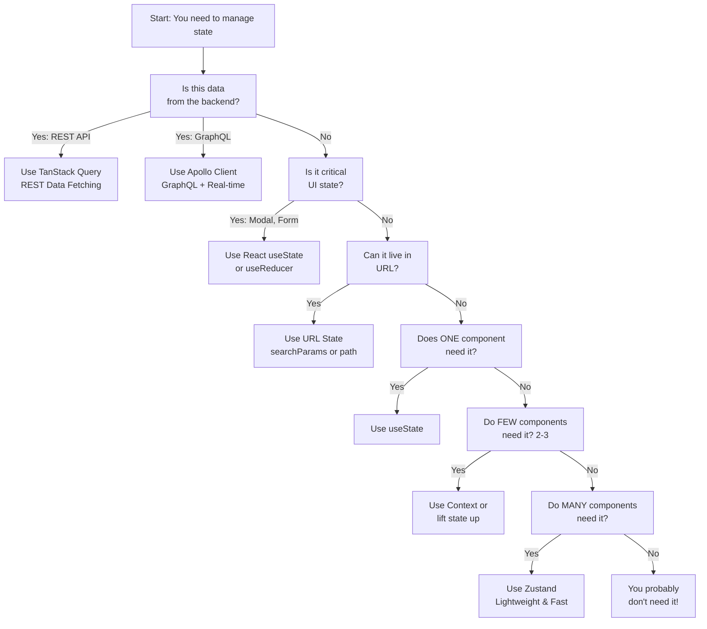
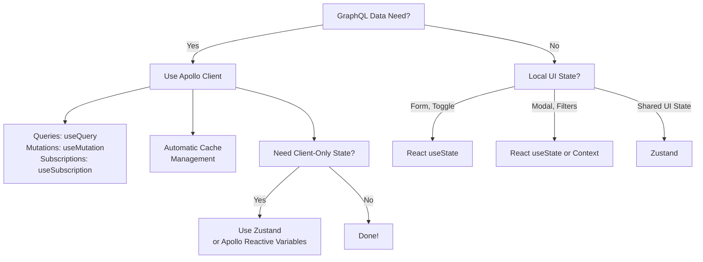
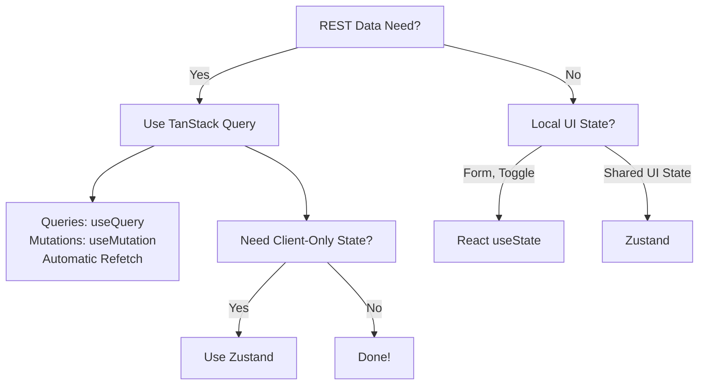

# State Management

> "Effective state management is the difference between a maintainable app and a maintenance nightmare."

---

## Foundational Principles

Before implementing any state management solution, understand these principles:

### 1. **Interface-First Thinking**

Define the state shape and data flow **before** implementation. How will components consume this state? What updates will they trigger?

### 2. **YAGNI (You Aren't Gonna Need It)**

Don't create global state managers "just in case." Start with React hooks. Add tooling only when needed for genuine problems.

### 3. **DRY (Don't Repeat Yourself)**

Extract repeated state patterns into custom hooks or stores. Eliminate duplication in data fetching and mutations.

### 4. **KISS (Keep It Simple, Stupid)**

Choose the simplest tool that solves your problem. Server state management first. Client state management only when necessary.

**Must Read:** [Development Principles](../00-development-principles/README.md)

---

## Overview

State management is about **organizing and controlling data flow** in your frontend application. Poor state management leads to bugs, performance issues, and difficulty testing. Good state management makes features predictable and easy to reason about.

The key insight: **Most state is server state**. Handle it properly, and your client state becomes simple.

---

## Goals

1. **Predictable data flow** - Understand where data comes from and how it changes
2. **Minimize complexity** - Use the simplest tool that solves the problem
3. **Performance** - Avoid unnecessary re-renders and data fetching
4. **Testability** - State changes are deterministic and easy to test
5. **Maintainability** - Code is easy to understand and modify

---

## Table of Contents

- [Foundational Principles](#foundational-principles)
- [Key Concepts](#key-concepts)
- [Decision Framework](#decision-framework)
- [Tools & Patterns](#tools--patterns)
- [Best Practices](#best-practices)
- [Practical Rules](#practical-rules)
- [Examples](#examples)

---

## Key Concepts

### Three Types of State

| Type                    | Purpose                                          | When to Use                     | Example Tools                 |
| ----------------------- | ------------------------------------------------ | ------------------------------- | ----------------------------- |
| **Server State**        | Data managed by backend (users, posts, settings) | Always fetch from server first  | TanStack Query, Apollo Client |
| **UI State**            | Local UI interactions (open/closed, form inputs) | Component-level interactions    | React `useState`, URL params  |
| **Global Client State** | Shared across many components                    | Only after trying React Context | Zustand (preferred), Jotai    |

**The 80/20 Rule:** 80% of your state is server state. Use proper server state management first, then UI state, then client state.

### State Flow Patterns

**Good Flow:**

```
Backend Data → TanStack Query/Apollo → Component Props → UI Updates
                    (Server State)              (UI State)
```

**Avoid:**

```
Backend Data → Global Store → Component Props → UI Updates
         (Unnecessary complexity)
```

### The State Management Hierarchy

**Use this decision tree in order. Stop when you find a solution:**

```
1. Can it be derived from other state? → YES → Don't store it
                                     → NO → Go to 2

2. Can it live in URL params?        → YES → Use URL (searchParams, path params)
                                     → NO → Go to 3

3. Is it server data?                → YES → Use TanStack Query (REST)
                                           or Apollo Client (GraphQL)
                                     → NO → Go to 4

4. Does one component need it?       → YES → Use useState
                                     → NO → Go to 5

5. Do 2-3 components need it?        → YES → Use Context or lift state up
                                     → NO → Go to 6

6. Do many components need it?       → YES → Use Zustand
                                     → NO → You probably don't need it
```

---

## Decision Framework

### Master Decision Tree



### For GraphQL Projects (Most Common)

Since most Enosta projects use GraphQL:



### For REST/Mixed Stack



---

## Tools & Patterns

### Server State Management

#### Apollo Client (GraphQL) — **PREFERRED**

**Why:** Most Enosta projects use GraphQL. Apollo Client provides normalized caching, automatic updates, and real-time subscriptions out of the box.

```typescript
// Query data
import { useQuery } from '@apollo/client';
import { GET_USERS_QUERY } from './queries';

function UserList() {
  const { data, loading, error } = useQuery(GET_USERS_QUERY);

  if (loading) return <div>Loading...</div>;
  if (error) return <div>Error: {error.message}</div>;

  return (
    <ul>
      {data?.users?.map(user => (
        <li key={user.id}>{user.name}</li>
      ))}
    </ul>
  );
}

// Mutate data (automatic cache update)
import { useMutation } from '@apollo/client';
import { CREATE_USER_MUTATION } from './mutations';

function CreateUserForm() {
  const [createUser, { loading }] = useMutation(CREATE_USER_MUTATION, {
    update(cache, { data: { createUser } }) {
      // Apollo automatically updates the cache
      cache.modify({
        fields: {
          users(existingUsers = []) {
            return [...existingUsers, createUser];
          }
        }
      });
    }
  });

  return (
    <form onSubmit={(e) => {
      e.preventDefault();
      createUser({ variables: { name: 'John' } });
    }}>
      <button type="submit" disabled={loading}>Create</button>
    </form>
  );
}

// Real-time subscriptions
import { useSubscription } from '@apollo/client';

function UserUpdates() {
  const { data } = useSubscription(ON_USER_CREATED_SUBSCRIPTION);
  // Automatically updates when new user is created
}
```

**Advantages:**

- ✅ Normalized cache automatically prevents duplicates
- ✅ Real-time subscriptions built-in
- ✅ Automatic re-fetch on mutation
- ✅ Strong TypeScript support with GraphQL Code Generator
- ✅ Minimal bundle overhead for GraphQL projects

**When to use:**

- All GraphQL APIs
- Real-time updates needed
- Complex relational data
- Multi-page applications

**Reference:** [API Integration - Apollo Client](../02-api-integration/apollo-client.md)

---

#### TanStack Query (REST APIs)

**Use for REST APIs** when Apollo Client is not an option.

```typescript
import { useQuery, useMutation, useQueryClient } from '@tanstack/react-query';

// Fetch data
function UserList() {
  const { data: users, isLoading } = useQuery({
    queryKey: ['users'],
    queryFn: () => fetch('/api/users').then(r => r.json())
  });

  if (isLoading) return <div>Loading...</div>;

  return (
    <ul>
      {users?.map(user => (
        <li key={user.id}>{user.name}</li>
      ))}
    </ul>
  );
}

// Mutate data
function CreateUserForm() {
  const queryClient = useQueryClient();

  const { mutate, isPending } = useMutation({
    mutationFn: (newUser) =>
      fetch('/api/users', { method: 'POST', body: JSON.stringify(newUser) })
        .then(r => r.json()),
    onSuccess: () => {
      queryClient.invalidateQueries({ queryKey: ['users'] });
    }
  });

  return (
    <form onSubmit={(e) => {
      e.preventDefault();
      mutate({ name: 'John' });
    }}>
      <button type="submit" disabled={isPending}>Create</button>
    </form>
  );
}
```

**Advantages:**

- ✅ Excellent for REST APIs
- ✅ Automatic background refetching
- ✅ Simple invalidation strategy
- ✅ Great TypeScript support

**When to use:**

- REST APIs only
- No real-time needs
- Simple data fetching

**Reference:** [API Integration - TanStack Query](../02-api-integration/tanstack-query.md)

---

### Global Client State Management

#### Zustand — **PREFERRED**

**Why:** Zustand is lightweight (2.1 KB), has excellent TypeScript support, no boilerplate, and requires the least learning curve. It's the default for Enosta for all new client state.

```typescript
import { create } from 'zustand';

// Define your store
interface AuthStore {
  user: User | null;
  token: string | null;
  login: (email: string, password: string) => Promise<void>;
  logout: () => void;
  isAuthenticated: boolean;
}

export const useAuthStore = create<AuthStore>((set) => ({
  user: null,
  token: null,
  isAuthenticated: false,

  login: async (email, password) => {
    const response = await fetch('/api/login', {
      method: 'POST',
      body: JSON.stringify({ email, password })
    });
    const data = await response.json();

    set({
      user: data.user,
      token: data.token,
      isAuthenticated: true
    });
  },

  logout: () => {
    set({ user: null, token: null, isAuthenticated: false });
  }
}));

// Use in components
function Profile() {
  const { user, logout, isAuthenticated } = useAuthStore();

  if (!isAuthenticated) return <div>Not logged in</div>;

  return (
    <div>
      <p>Welcome, {user?.name}</p>
      <button onClick={logout}>Logout</button>
    </div>
  );
}

// Subscribe to specific fields (performance optimization)
function AuthStatus() {
  const isAuthenticated = useAuthStore(state => state.isAuthenticated);
  return <div>{isAuthenticated ? 'Logged in' : 'Logged out'}</div>;
}
```

**Store Organization Pattern:**

```typescript
// src/stores/auth.ts
export const useAuthStore = create<AuthStore>((set, get) => ({...}));

// src/stores/ui.ts
export const useUIStore = create<UIStore>((set) => ({...}));

// src/stores/index.ts (barrel export from core)
export { useAuthStore } from './auth';
export { useUIStore } from './ui';

// In components, import from core
import { useAuthStore, useUIStore } from '@/core/stores';
```

**Advantages:**

- ✅ Minimal boilerplate (no actions, reducers, providers)
- ✅ Excellent TypeScript inference
- ✅ Automatic React Concurrent Features support
- ✅ Smallest bundle size (2.1 KB)
- ✅ Can be used outside React
- ✅ No Context API overhead

**When to use:**

- ANY global client state
- Authentication status
- Theme preferences
- UI state (modals, filters, sorting)
- Form state that needs to be shared

**Must Read:** [Zustand Documentation](https://github.com/pmndrs/zustand)

---

#### React Context (Simple Shared State)

Use Context **only** for:

- Theme/dark mode
- Language preferences
- Simple auth status (no complex logic)

```typescript
import { createContext, useContext, useState } from 'react';

interface ThemeContextType {
  theme: 'light' | 'dark';
  toggleTheme: () => void;
}

const ThemeContext = createContext<ThemeContextType | undefined>(undefined);

export function ThemeProvider({ children }: { children: React.ReactNode }) {
  const [theme, setTheme] = useState<'light' | 'dark'>('light');

  return (
    <ThemeContext.Provider value={{
      theme,
      toggleTheme: () => setTheme(t => t === 'light' ? 'dark' : 'light')
    }}>
      {children}
    </ThemeContext.Provider>
  );
}

export function useTheme() {
  const context = useContext(ThemeContext);
  if (!context) throw new Error('useTheme must be used within ThemeProvider');
  return context;
}
```

**Advantages:**

- ✅ No external dependencies
- ✅ Built into React
- ✅ Good for simple state

**Disadvantages:**

- ❌ Re-renders all consumers on any state change
- ❌ No built-in optimizations
- ❌ Verbose boilerplate
- ❌ Don't use for high-frequency updates

---

### Avoid These

❌ **Redux** - Too much boilerplate for modern React. Zustand is simpler and faster.

❌ **MobX** - Implicit reactivity makes code harder to reason about.

❌ **Recoil** - Experimental, unstable API. Use Zustand or Jotai instead.

❌ **Prop Drilling** - If you're passing props through 3+ levels, use proper state management.

### Client State Management

#### Local Component State (useState)

```typescript
// Keep state as close as possible
export function Counter() {
  const [count, setCount] = useState(0);

  return (
    <div>
      <p>{count}</p>
      <button onClick={() => setCount(count + 1)}>Increment</button>
    </div>
  );
}
```

**When to use:**

- Temporary UI interactions
- Form inputs
- Toggle states
- Single component use

#### React Context + Hooks

```typescript
// For sharing state across many components
const ThemeContext = createContext();

export function ThemeProvider({ children }) {
  const [theme, setTheme] = useState('light');

  return (
    <ThemeContext.Provider value={{ theme, setTheme }}>
      {children}
    </ThemeContext.Provider>
  );
}

export const useTheme = () => useContext(ThemeContext);
```

**When to use:**

- Theme selection
- Auth/user info
- Locale/language
- Avoid prop drilling (2+ levels)

#### Zustand (Global State)

```typescript
import { create } from 'zustand';

export const useAuthStore = create((set) => ({
  user: null,
  isLoggedIn: false,

  login: (user) => set({ user, isLoggedIn: true }),
  logout: () => set({ user: null, isLoggedIn: false }),
}));

// Usage in component
function Header() {
  const { user, logout } = useAuthStore();
  return <button onClick={logout}>{user?.name}</button>;
}
```

**When to use:**

- Complex global state
- Multiple unrelated stores
- Middleware/interceptors needed
- Action handlers needed

**Best Practices:**

- Keep stores focused (one store = one domain)
- Use selectors to prevent unnecessary re-renders
- Persist to localStorage when needed

#### Jotai (Atomic State)

```typescript
import { atom, useAtom } from 'jotai';

const countAtom = atom(0);
const doubledAtom = atom((get) => get(countAtom) * 2);

export function Counter() {
  const [count, setCount] = useAtom(countAtom);
  const [doubled] = useAtom(doubledAtom);

  return (
    <div>
      <p>{count} → {doubled}</p>
      <button onClick={() => setCount(c => c + 1)}>+</button>
    </div>
  );
}
```

**When to use:**

- Reactive derived state
- Minimal boilerplate
- Atomic composition
- Code splitting benefits

---

## Practical Rules

### Rule 1: Server State First, Always

**Every data source from your backend should go through Apollo Client or TanStack Query.**

```typescript
// ❌ Bad: Storing server data in Zustand
const useUserStore = create((set) => ({
  users: [],
  fetchUsers: async () => {
    const response = await fetch('/api/users');
    const data = await response.json();
    set({ users: data }); // Duplicating server state
  }
}));

// ✅ Good: Using Apollo Client
const GET_USERS = gql`
  query GetUsers {
    users { id name email }
  }
`;

function UserList() {
  const { data } = useQuery(GET_USERS);
  return <ul>{data?.users?.map(u => <li key={u.id}>{u.name}</li>)}</ul>;
}
```

**Why:** Apollo/TanStack Query handle caching, background updates, and invalidation automatically. Zustand is for client-only state.

---

### Rule 2: Keep Zustand Stores Focused

**Each Zustand store should have ONE responsibility.** Don't create a "mega store."

```typescript
// ❌ Bad: Mega store doing everything
const useAppStore = create((set) => ({
  user: null,
  theme: 'light',
  sidebarOpen: false,
  notifications: [],
  filters: {},
  ...everything else...
}));

// ✅ Good: Separate concerns
const useAuthStore = create((set) => ({ user: null, login: () => {} }));
const useUIStore = create((set) => ({ theme: 'light', sidebarOpen: false }));
const useNotificationStore = create((set) => ({ notifications: [] }));
```

**Why:** Smaller stores are easier to test, debug, and maintain. They also enable better performance optimization through selective subscriptions.

---

### Rule 3: Use Selectors for Performance

**Always select only the fields you need from your store.**

```typescript
// ❌ Bad: Subscribe to entire store, re-render on any change
function Header() {
  const store = useAuthStore(); // Re-renders even if theme changes
  return <div>{store.user?.name}</div>;
}

// ✅ Good: Select only what you need
function Header() {
  const userName = useAuthStore(state => state.user?.name);
  return <div>{userName}</div>; // Only re-renders if user changes
}
```

---

### Rule 4: Mutations in Apollo Client

**Use Apollo mutations for backend changes, not Zustand.**

```typescript
// ❌ Bad: Manual updates in Zustand
const useUserStore = create((set) => ({
  updateUser: async (id, data) => {
    const response = await fetch(`/api/users/${id}`, {
      method: 'PUT',
      body: JSON.stringify(data)
    });
    set({ user: await response.json() });
  }
}));

// ✅ Good: Use Apollo mutations
const UPDATE_USER = gql`
  mutation UpdateUser($id: ID!, $data: UserInput!) {
    updateUser(id: $id, data: $data) { id name email }
  }
`;

function UserProfile() {
  const [updateUser] = useMutation(UPDATE_USER);

  return (
    <button onClick={() => updateUser({
      variables: { id: '1', data: { name: 'Jane' } }
    })}>
      Update
    </button>
  );
}
```

**Why:** Apollo handles cache invalidation automatically. Manual updates in Zustand can cause inconsistencies.

---

### Rule 5: URL State for Navigation & Filtering

**Filters, sorting, pagination = URL params.** Not Zustand.

```typescript
// ❌ Bad: Storing in Zustand
const useFiltersStore = create((set) => ({
  category: 'all',
  sortBy: 'newest',
  page: 1
}));

// ✅ Good: URL params (works with back button, bookmarking, sharing)
function ProductList() {
  const router = useRouter();
  const { category = 'all', sort = 'newest', page = '1' } = router.query;

  return <Products category={category} sort={sort} page={parseInt(page)} />;
}
```

**Why:** Browser back button, bookmarking, and URL sharing all work correctly. Zustand state is lost on refresh.

---

### Rule 6: Form State Strategy

**Local forms = useState. Multi-step forms across pages = Zustand.**

```typescript
// ✅ Single form: Use React Hook Form + useState
import { useForm } from 'react-hook-form';

function LoginForm() {
  const { register, handleSubmit } = useForm();

  return <form onSubmit={handleSubmit((data) => submitLogin(data))} />;
}

// ✅ Multi-step wizard: Use Zustand
const useCheckoutStore = create((set) => ({
  step1: { email: '', },
  step2: { address: '', },
  step3: { paymentMethod: '', },
  updateStep: (step, data) => set((state) => ({
    [`step${step}`]: data
  }))
}));
```

---

### Rule 7: Never Duplicate Server State

**If it exists in Apollo/TanStack Query, don't store it in Zustand.**

```typescript
// ❌ Bad: Duplication
const GET_USER = gql`query GetUser { user { id name email } }`;

const useUserStore = create((set) => ({
  userName: '', // Duplicated from Apollo
  updateName: (name) => set({ userName: name })
}));

// ✅ Good: Single source of truth
function UserProfile() {
  const { data } = useQuery(GET_USER);
  const [updateUser] = useMutation(UPDATE_USER_MUTATION);

  return (
    <input
      value={data?.user?.name}
      onChange={(e) => updateUser({ variables: { name: e.target.value } })}
    />
  );
}
```

---

## Best Practices

### ✅ DO

- **Use server state management for API data** - TanStack Query or Apollo Client
- **Keep state close to where it's used** - Prefer `useState` over global state
- **Use context for deep nesting** - Theme, auth, i18n
- **Split concerns** - Separate UI state from business logic
- **Use selectors** - Prevent unnecessary re-renders in Zustand/Jotai
- **Cache aggressively** - Let TanStack Query/Apollo handle freshness
- **Normalize data** - Apollo Client does this automatically

### ❌ DON'T

- **Use global state for everything** - Start with `useState` first
- **Put server state in Zustand** - Use TanStack Query/Apollo Client
- **Create overly complex stores** - Split into multiple focused stores
- **Fetch data in multiple places** - Centralize in one hook/query
- **Update state without invalidation** - Let TanStack Query sync cache
- **Mix server and client state** - Keep them separate

---

## Architecture Integration

### Where State Lives in the Layers

```
MODULES
├── useAuthStore (Zustand) → "authenticated user"
├── useNotifications (Zustand) → "app-wide toast state"
└── hooks/
    ├── useGetPosts (TanStack Query) → "server state"
    └── useCreatePost (TanStack Query) → "mutations"

CORE
├── apiClient
├── queryClient (TanStack Query config)
└── apolloClient (Apollo Client config)

SHARED
├── hooks/
│   ├── useDebounce
│   ├── useAsync
│   └── useFetch
└── utils/normalizeData.ts
```

---

## Examples

### Example 1: Fetching Posts (Server State)

```typescript
// queries/posts.ts
import { useQuery } from '@tanstack/react-query';

export const useGetPosts = (limit = 10) => {
  return useQuery({
    queryKey: ['posts', limit],
    queryFn: async () => {
      const res = await fetch(`/api/posts?limit=${limit}`);
      return res.json();
    },
    staleTime: 5 * 60 * 1000, // 5 minutes
  });
};

// Component
function PostList() {
  const { data: posts, isLoading } = useGetPosts();

  return isLoading ? <div>Loading...</div> : (
    <div>
      {posts?.map(post => <PostCard key={post.id} post={post} />)}
    </div>
  );
}
```

### Example 2: Form Input (Local State)

```typescript
function LoginForm() {
  const [email, setEmail] = useState('');
  const [password, setPassword] = useState('');
  const [error, setError] = useState('');

  const handleSubmit = async (e) => {
    e.preventDefault();
    setError('');

    try {
      const res = await fetch('/api/login', {
        method: 'POST',
        body: JSON.stringify({ email, password })
      });

      if (!res.ok) throw new Error('Invalid credentials');
      // Handle success
    } catch (err) {
      setError(err.message);
    }
  };

  return (
    <form onSubmit={handleSubmit}>
      <input
        value={email}
        onChange={(e) => setEmail(e.target.value)}
        placeholder="Email"
      />
      <input
        value={password}
        onChange={(e) => setPassword(e.target.value)}
        type="password"
        placeholder="Password"
      />
      {error && <p>{error}</p>}
      <button type="submit">Login</button>
    </form>
  );
}
```

### Example 3: Global Auth State (Zustand)

```typescript
// stores/authStore.ts
import { create } from 'zustand';
import { persist } from 'zustand/middleware';

export const useAuthStore = create(
  persist(
    (set) => ({
      user: null,
      token: null,

      setUser: (user, token) => set({ user, token }),
      logout: () => set({ user: null, token: null }),

      isAuthenticated: () => !!useAuthStore.getState().user,
    }),
    {
      name: 'auth-store', // localStorage key
    }
  )
);

// Component
function Profile() {
  const { user, logout } = useAuthStore();

  return (
    <div>
      <p>Welcome, {user?.name}</p>
      <button onClick={logout}>Logout</button>
    </div>
  );
}
```

### Example 4: Form with Mutation (Server Update)

```typescript
function CreatePostForm() {
  const [title, setTitle] = useState('');
  const [content, setContent] = useState('');

  const { mutate, isPending } = useMutation({
    mutationFn: async (data) => {
      const res = await fetch('/api/posts', {
        method: 'POST',
        body: JSON.stringify(data)
      });
      return res.json();
    },
    onSuccess: (newPost) => {
      // TanStack Query will invalidate and refetch
      queryClient.setQueryData(['posts'], (old) => [...old, newPost]);
      setTitle('');
      setContent('');
    },
    onError: (error) => {
      console.error('Failed to create post:', error);
    }
  });

  const handleSubmit = (e) => {
    e.preventDefault();
    mutate({ title, content });
  };

  return (
    <form onSubmit={handleSubmit}>
      <input
        value={title}
        onChange={(e) => setTitle(e.target.value)}
        placeholder="Title"
      />
      <textarea
        value={content}
        onChange={(e) => setContent(e.target.value)}
        placeholder="Content"
      />
      <button type="submit" disabled={isPending}>
        {isPending ? 'Creating...' : 'Create'}
      </button>
    </form>
  );
}
```

---

## Workflow & Checklist

When implementing state management for a feature:

- [ ] Identify if it's server state or client state
- [ ] For server state: Choose TanStack Query or Apollo Client
- [ ] For client state: Start with `useState`, then context if shared
- [ ] For global state: Use Zustand or Jotai
- [ ] Document the data flow
- [ ] Set up proper loading/error states
- [ ] Consider caching strategy
- [ ] Test state changes in isolation
- [ ] Review with team for consistency

---

## References

- [TanStack Query Documentation](https://tanstack.com/query/latest)
- [Apollo Client Documentation](https://www.apollographql.com/docs/react/)
- [Zustand Documentation](https://github.com/pmndrs/zustand)
- [Jotai Documentation](https://jotai.org/)
- [API Integration Patterns](../02-api-integration/README.md)
